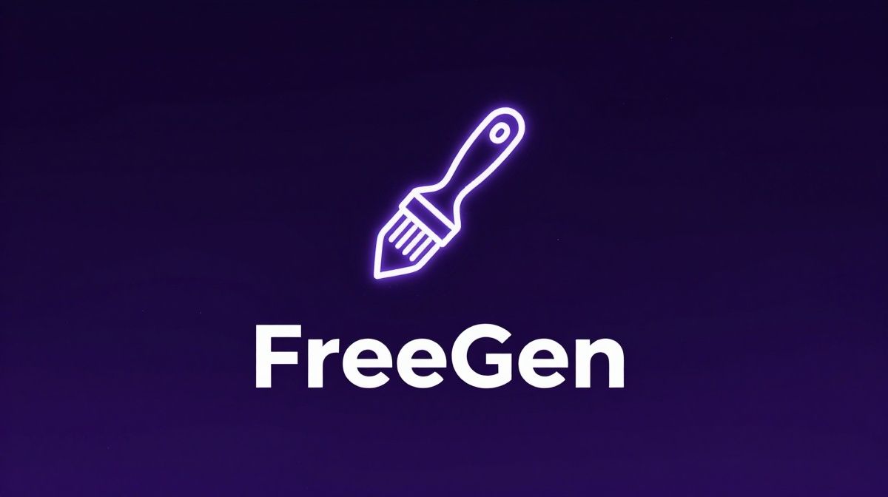

<p align="center">
  
</p>

<h1 align="center">🎨 FreeGen</h1>

<p align="center">
  <strong>Free AI Image Generation for Hermes Agent</strong><br>
  No API key. No signup. No payment. Just works.
</p>

<p align="center">
  <a href="https://github.com/abhi-0203/hermes-freegen-skill/blob/main/LICENSE"></a>
  <a href="https://github.com/abhi-0203/hermes-freegen-skill"></a>
  <a href="https://github.com/NousResearch/hermes-agent"></a>
  <a href="https://github.com/abhi-0203/hermes-freegen-skill/releases"></a>
</p>

---

Drop-in plugin for [Hermes Agent](https://github.com/NousResearch/hermes-agent) that adds free AI image generation via [freegen.app](https://freegen.app)'s public Z-Image Turbo model.

## Table of Contents

- [Why FreeGen?](#why-freegen)
- [Quick Install](#quick-install)
- [Features](#features)
- [Examples](#examples)
- [How It Works](#how-it-works)
- [Configuration](#configuration)
- [API Usage](#api-usage)
- [Limitations](#limitations)
- [Troubleshooting](#troubleshooting)
- [Documentation](#documentation)
- [Contributing](#contributing)
- [License](#license)

## Why FreeGen?

I got tired of every "free" image API being dead or behind a paywall in 2026:

| Provider | Status |
|----------|--------|
| Pollinations | 💀 Crypto payments required |
| StableHorde | 🔑 API key required |
| Puter.js | 🔒 Auth flow required |
| Civitai, DeepAI, Together, Segmind | 🚫 401/403 errors |
| **FreeGen** | ✅ **Works — no signup, no key** |

**FreeGen is the only working free option left.** It reverse-engineers freegen.app's browser-based image generator so you can generate images from your terminal, Telegram, or Discord — no account needed.

## Quick Install

```bash
# Clone this repo
git clone https://github.com/abhi-0203/hermes-freegen-skill.git
cd hermes-freegen-skill

# Run the installer
bash scripts/install.sh
```

Then restart your gateway:

```bash
hermes gateway restart
```

### Manual Install (3 steps)

If you prefer to install manually:

**Step 1:** Copy the plugin files

```bash
mkdir -p ~/.hermes/plugins/freegen
cp scripts/__init__.py ~/.hermes/plugins/freegen/__init__.py
cp templates/plugin.yaml ~/.hermes/plugins/freegen/plugin.yaml
```

**Step 2:** Add to your Hermes config (`~/.hermes/config.yaml`)

```yaml
image_gen:
  provider: freegen
  model: zimage
  use_gateway: false

plugins:
  enabled:
    - freegen
```

**Step 3:** Verify

```bash
hermes plugins list    # should show freegen as enabled
```

## Features

| Feature | Description |
|---------|-------------|
| `/gen <prompt>` | Generate images directly from Telegram/Discord/CLI |
| `/img` / `/imagine` | Aliases for `/gen` |
| `image_generate` tool | Agent can generate images on demand |
| Zero config | No API keys, no signup required |
| Multiple ratios | Square (1:1), landscape (16:9), portrait (9:16) |
| Batch support | Generate multiple images in parallel via subagents |

## Examples

### Basic Prompts

```
/gen golden retriever puppy playing in a sunlit garden
/gen woman in elegant red saree at golden hour, cinematic portrait
/gen sunset over Hyderabad Charminar, warm tones, dreamy atmosphere
/gen cozy coffee shop scene with fairy lights, rainy evening
/gen astronaut floating above Earth, dramatic lighting
```

### Styled Prompts

```
/gen cyberpunk cityscape at night, neon reflections on wet streets, blade runner aesthetic
/gen minimalist Japanese zen garden with cherry blossoms, soft morning light
/gen steampunk airship floating above Victorian London, golden hour
/gen underwater coral reef with tropical fish, sunbeams filtering through water
```

### Using Aspect Ratios

```
/gen panoramic mountain landscape at sunrise --ratio landscape
/gen close-up portrait of a cat with heterochromia eyes --ratio square
/gen vertical fashion editorial shot, model in red dress --ratio portrait
```

### Prompt Structure (for best results)

Follow this formula for consistent, high-quality results:

```
[Subject] + [Setting/Background] + [Lighting] + [Clothing/Details] + [Mood/Style]
```

**Example breakdown:**
```
A golden retriever puppy (subject)
playing in a sunlit garden (setting)
with warm afternoon light (lighting)
wearing a small red bandana (details)
happy joyful mood, photography style (mood/style)
```

## How It Works

Uses freegen.app's public anonymous pipeline:

```
┌─────────────────┐     ┌──────────────────┐     ┌─────────────────┐
│  Prompt Signer  │────▶│ Image Generator  │────▶│    WebSocket    │
│  POST /sign     │     │ POST /generate   │     │  Receive image  │
└─────────────────┘     └──────────────────┘     └─────────────────┘
```

1. **Sign** — POST the prompt to `prompt-signer.freegen.app` → get `{ts, sig}`
2. **Submit** — POST to `image-generator.freegen.app` with prompt + signature → get `{job_id}`
3. **Subscribe** — Connect via WebSocket to `websocket-bridge.freegen.app` → receive the generated image

No accounts, no rate limits (per-IP queue), no payment. Total time: ~5–30 seconds per image.

## Configuration

### Required Config (`~/.hermes/config.yaml`)

```yaml
image_gen:
  provider: freegen
  model: zimage
  use_gateway: false

plugins:
  enabled:
    - freegen
```

### Plugin Metadata (`~/.hermes/plugins/freegen/plugin.yaml`)

```yaml
name: freegen
version: 1.11.0
description: "Free freegen.app image generation backend (Z-Image Turbo). No API key, no signup — anonymous prompt-signer + WebSocket pipeline."
author: abhi_mawa
kind: backend
requires_env: []  # completely keyless
optional_env: []
```

## API Usage

The plugin registers as an `ImageGenProvider` with these methods:

```python
from agent.image_gen_provider import ImageGenProvider

# List available models
provider.list_models()
# → [{"id": "zimage", "name": "Z-Image Turbo", ...}]

# Generate an image
result = provider.generate(
    prompt="a golden retriever in a garden",
    aspect_ratio="square",  # "square", "landscape", or "portrait"
    model="zimage"
)
# → {"success": True, "image": "/path/to/image.jpg", ...}
```

### Supported Aspect Ratios

| Ratio | ID | Resolution |
|-------|-----|------------|
| Square | `1:1` | 896×896 |
| Landscape | `16:9` | 896×504 |
| Portrait | `9:16` | 672×1200 |
| Wide | `16:9` | alias for landscape |
| Tall | `9:16` | alias for portrait |
| Ultrawide | `16:9` | alias for landscape |

## Limitations

| Field | Value |
|-------|-------|
| Model | `zimage` (Z-Image Turbo) — only one available |
| Aspect ratios | `1:1` (square), `4:3`, `16:9`, `9:16` (portrait) |
| Prompt length | ≤ 2,000 characters |
| Cost | Free, ad-supported |
| Rate limit | Per-IP queue (max 1 concurrent) |
| Auth | None required |
| Typical size | Square: 896×896, Portrait: 672×1200 JPEG |

## Troubleshooting

### "asyncio.run() cannot be called from a running event loop"

The gateway runs inside an asyncio event loop. The plugin detects this automatically and offloads WebSocket communication to a separate thread. This is fixed in v1.0.0+ — if you see this error, update your `__init__.py`:

```bash
cp scripts/__init__.py ~/.hermes/plugins/freegen/__init__.py
hermes gateway restart
```

### "image generation is unavailable" or "FAL_KEY not set"

Missing `image_gen:` routing block in config. Add to `~/.hermes/config.yaml`:

```yaml
image_gen:
  provider: freegen
  model: zimage
```

### HTTP 403 from signer/generator

FreeGen's edge requires a browser User-Agent. The plugin includes one — make sure you copied the full `__init__.py` with the `_BROWSER_HEADERS` dict.

### WebSocket timeout

Queue can be long on busy days (shared AWS IPs). The plugin waits 180s. If it consistently times out, the service may be overloaded — try again in a few minutes.

### Same image every time

You're hitting the CDN cache. Use a fresh unique prompt (embed timestamp or random). The plugin always sends new prompts, so this shouldn't happen in normal use.

### Slash commands not showing in Telegram menu

Telegram's bot menu has a `MAX_COMMANDS_PER_SCOPE` limit (default 30). Core Hermes commands (45+) take priority and fill all slots — plugin commands get trimmed silently.

**Fix:** Increase the limit in the Telegram platform adapter:
```python
MAX_COMMANDS_PER_SCOPE = 50  # default is 30
```

Then restart gateway. Commands still **work** even without menu — just type `/gen a prompt` directly.

**Verify commands are registered:**
```bash
cd ~/.hermes/hermes-agent && source venv/bin/activate && python3 -c "
from hermes_cli.plugins import get_plugin_commands
cmds = get_plugin_commands()
print(list(cmds.keys()))
"
```

## Documentation

| Document | Description |
|----------|-------------|
| [SKILL.md](SKILL.md) | Full skill documentation: architecture, config, usage |
| [CONTRIBUTING.md](CONTRIBUTING.md) | How to contribute, development setup, PR guidelines |
| [CHANGELOG.md](CHANGELOG.md) | Version history and release notes |
| [references/batch-generation-patterns.md](skills/freegen-image-gen/references/batch-generation-patterns.md) | Batch generation and prompt formulas |

## Contributing

Found a bug? Have an improvement? Open an issue or submit a PR! See [CONTRIBUTING.md](CONTRIBUTING.md) for guidelines.

## License

[MIT](LICENSE) — use freely, modify freely. Built by the Hermes community.

---

*Built with ☕ by [abhi_mawa](https://github.com/abhi-0203) — because I just wanted free images without the hassle.*
